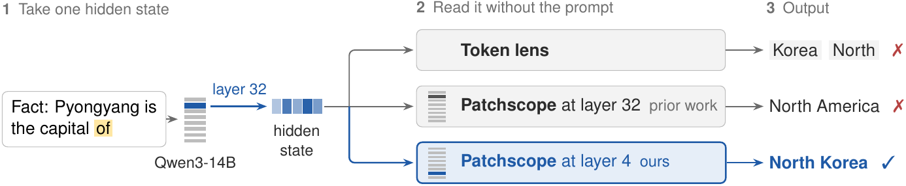
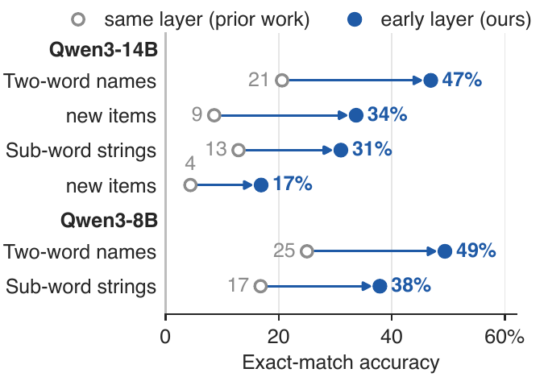

# Reading Multi-Token Answers from a Single Hidden State

Code, data and per-item results for the paper *Reading Multi-Token Answers from a Single Hidden State* (Arnav Raj, 2026).

Token lenses such as the logit lens read a hidden state one token at a time, so they cannot return an answer like "North Korea" as a string. We decode the state with the model itself. A Patchscope writes the state into a short copy prompt and lets the model generate. Our change is to write the state into an early layer of that prompt, far below the layer it came from. On Qwen3-14B this raises exact recovery of held-out two-word answers from 21% to 47%, and substitute states (another item's state or a random vector) almost never produce the answer. The method needs no training.

<p align="center">
  
</p>

*The hidden state of the last prompt token at layer 32 of Qwen3-14B, read without the prompt. The token lens returns separate tokens. Patching the state into the copy prompt at layer 32 gives "North America", and patching it at layer 4 gives "North Korea".*

## Key results

| Setting | Prior readout | Ours |
| --- | --- | --- |
| Qwen3-14B, 175 held-out two-word answers, exact match | 21% (Patchscope at the source layer) | **47%** (Patchscope at layer 4) |
| Controls on our items (shuffled, cross-category and random states) | | at most 0.7% |
| WorkspaceBench basic readout, Qwen3.6-27B, 100 items | 0% (J-lens and logit lens) | **14%** |

The effect also holds for answers that the tokenizer splits into sub-word pieces, on Qwen3-8B (with layer 8 as the early layer), and on a new test set of 1,002 items whose answers do not overlap with earlier items. Figure 2 of the paper gives every pair:

<p align="center">
  
</p>

On WorkspaceBench we use a second target prompt, a neutral sentence such as "The answer is" that the model continues. With the benchmark's own model and scorer it reaches 21% on typo correction, above the published token lenses with an LLM summary (17% and 20%), and it uses no external language model.

## Installation

The code needs Python 3.11 and a GPU for the model runs.

```bash
git clone https://github.com/deadsmash07/multitoken-readout.git
cd multitoken-readout
pip install -r requirements.txt
```

Models load from the Hugging Face Hub (`Qwen/Qwen3-1.7B`, `Qwen/Qwen3-8B`, `Qwen/Qwen3-14B` and `Qwen/Qwen3.6-27B`). The 27B model uses hybrid attention and also needs `flash-linear-attention`. The token lenses load the released J-lens files from `neuronpedia/jacobian-lens` (Gurnee et al., 2026). One 80 GB GPU runs every experiment, and the 1.7B model fits on a smaller card.

## Quickstart

This command runs the main result: Qwen3-14B, held-out two-word items, state read at layer 32 and written either at layer 32 or at layer 4, with all three controls.

```bash
python scripts/x3_patchscope.py --model Qwen/Qwen3-14B --dtype bf16-mixed \
  --items data/phrase_items.json --split-file data/phrase_split.json --layers 32 \
  --target-layer same,4 --split heldout --kinds answer --carriers identity3 --n-carriers 8 \
  --modes replace --gen 8 --positions last --controls shuffled,crosscat,random \
  --device cuda --tag w3_B_x3i3_14b_ans_L32
```

It writes `runs/w3_B_x3i3_14b_ans_L32/results.json`. The shipped copy of that file is the one behind the 21% and 47% in the paper.

You do not need a GPU to check the numbers. The analysis scripts recompute every table and interval from the shipped result files on CPU:

```bash
python paper/analysis/provenance.py        # each main-text number with its run, configuration and counts
python paper/analysis/paired_clustered.py  # paired differences, intervals clustered by answer string, binomial tests
python paper/analysis/carriers.py          # counts for each of the eight prompt variants
```

Their outputs match the files already in `paper/analysis/`.

## Repository layout

```
sjlens/                      library: a minimal Qwen3 forward pass with activation patching, J-lens
                             utilities, the WorkspaceBench scorer (wsbench_regex.py), evaluation helpers
scripts/x3_patchscope.py     the Patchscope readers (copy prompt and continuation prompt) at any source and
                             target layer, with the shuffled, cross-category and random controls
scripts/x8_wsbench_items.py  WorkspaceBench runs for token lenses and Patchscopes, scored with the bench regex
scripts/                     the linear readers of the second answer token (step readout, beam decoder,
                             probe) and the scripts that build the item sets
data/                        item sets: two-word names, sub-word strings, the new test set, bridge and
                             neutral-context items; data/wsbench/ holds the WorkspaceBench item banks
contexts/                    generic token contexts used to fit the linear readers
runs/<name>/results.json     the result file behind each number in the paper, with its full configuration
paper/analysis/              CPU scripts that recompute the paper's tables and intervals from runs/
paper/figures/               figure PDFs and the scripts that draw them (src/)
jobs/                        the exact run commands, one per line: run name, a tab, then the python arguments
tests/                       CPU tests on a tiny random Qwen3 model
PROVENANCE.md                maps every number in the paper and its appendix to a result file
```

## Reproducing the paper

Every run writes `runs/<name>/results.json`, which stores its configuration and per-item outputs. The command for a run is the line in `jobs/` that starts with its name. To launch one from its job line:

```bash
awk -F'\t' '$1=="w3_B_x3i3_14b_ans_L32"{print $2}' jobs/x3_identity3.txt | xargs python
```

Some lines in `jobs/wave5.txt` start with `# `. Those runs depended on an earlier result and were launched separately; remove the `# ` to use them. A few runs have no job line, and for those the configuration in `results.json` is the record.

| Paper item | Runs | Job file |
| --- | --- | --- |
| Figure 2, Table 1 and Table A3 (same layer vs. early layer) | `w3_B_x3i3_14b_ans_L32`, `w3_A_x3i3_14b_ans_L32`, `w3_A_x3i3_1p7b_ans_L22` | `jobs/x3_identity3.txt` |
| | corrected controls `w3c_*` | `jobs/x3_controls_fix.txt` |
| | new test set and Qwen3-8B (`w5_8b_*_x3i3_L29`) | `jobs/wave5.txt` |
| Table 2 and Table A6 (WorkspaceBench) | `w5_27b_full_basic`, `w5_27b_full_typo`, `w5_27b_full_multihop` | `jobs/wave5.txt` |
| 14B benchmark pilot and its controls | `w5_ctrl_14b_basic_typo` | `jobs/wave5.txt` |
| Figure 3 and Table A5 (patching every lower layer) | `w5_ph_14b_B_i3`, `w5_ph_14b_B_cont`, `w4_B_x3cont_14b_ans_L32` | `jobs/wave5.txt` |
| Table A4 (linear readouts of the second token) | `p2_*_14b` (probe), `w2A_x1_14b_L32_s*` (one-position patch), `w2B_e14_14b_L32` (closed list) | `jobs/p2p3.txt`, `jobs/wave2.txt` |
| | `s2_g8_L16` (step readout), `hp_heldout_L18`, `hp_heldout_L22` (beam decoder) | configuration in `results.json` |
| Table A7 (bridge entities) | `w5_br_14b_B_fh`, `w5_a26_14b_neutral_v2`, `w5_br_14b_mh_scan` | `jobs/wave5.txt` |

`PROVENANCE.md` lists the run, layer, prompt, scoring rule and counts for every number, including the appendix tables.

## Tests

```bash
python tests/test_wave4_tiny.py
python tests/test_wave5_tiny.py
```

The tests run on CPU with a tiny random Qwen3 model. They check the patching, the readers, the controls and the benchmark scorer.

## Citation

```bibtex
@misc{raj2026multitoken,
  title         = {Reading Multi-Token Answers from a Single Hidden State},
  author        = {Raj, Arnav},
  year          = {2026},
  eprint        = {TODO},
  archivePrefix = {arXiv},
  primaryClass  = {cs.CL},
  note          = {TODO: add the arXiv identifier}
}
```

## License

The code is released under the MIT License (see `LICENSE`). The WorkspaceBench item banks in `data/wsbench/` come from [camilablank/workspace-bench](https://github.com/camilablank/workspace-bench) and keep their own MIT License (see `data/wsbench/NOTICE.md`).
